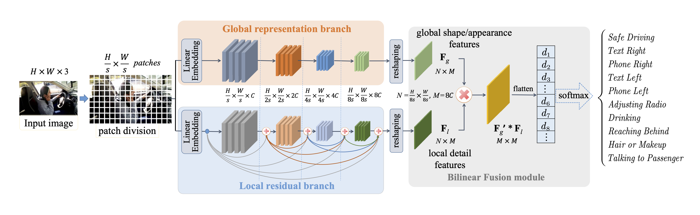

# BiRSwinT

This repo is the official implementation of ["BiRSwinT: Bilinear Full-Scale Residual Swin-Transformer for Fine-Grained Driver Behavior Recognition"](https://www.sciencedirect.com/science/article/abs/pii/S0016003222008857?via%3Dihub). It currently includes code and models for the following tasks:

> **Image Classification**: Included in this repo. See [get_started.md](get_started.md) for a quick start.

## Updates

**_12/26/2022_**

Initial commits:

1. Pretrained models for Swin-Transformer-S on ImageNet-1K ([Swin-T-IN1K](https://github.com/SwinTransformer/storage/releases/download/v1.0.0/swin_tiny_patch4_window7_224.pth), [Swin-S-IN1K](https://github.com/SwinTransformer/storage/releases/download/v1.0.0/swin_small_patch4_window7_224.pth), [Swin-B-IN1K](https://github.com/SwinTransformer/storage/releases/download/v1.0.0/swin_base_patch4_window7_224.pth)) and ImageNet-22K ([Swin-B-IN22K](https://github.com/SwinTransformer/storage/releases/download/v1.0.0/swin_base_patch4_window7_224_22k.pth), [Swin-L-IN22K](https://github.com/SwinTransformer/storage/releases/download/v1.0.0/swin_large_patch4_window7_224_22k.pth)) are provided.
2. The supported code for AUC and StateFarm image classification are provided.

## Introduction

**BiRSwinT** The bilinear fusion method can solve the fine-grained recognition problem to a certain extent.
After getting the deep descriptors of an image, bilinear pooling computes the sum of the outer
product of those deep descriptors. Bilinear pooling captures all pairwise descriptor interactions,
i.e., interactions of different part.

    This project aims at solving the problem of poor fine-grained characterization of a single
    Swin-Transformer model in driver distraction tasks.We interpret the two branches of the bilinear
    model as the global feature branch and the local feature branch, respectively, with the global branch
    applying the Swin-Transformer-S model and the local branch applying the Dense-Swin-Transformer model
    with residuals between Stages.



## Preparing the Model Data

There are two checkpoints in BiRSwinT.py where we need to use some pre-trained model files.You can download these two files from here: https://huggingface.co/Pluto2469/BiRSwinT/blob/main/

## Citing BiRSwinT

```
@article{YANG20231166,
title = {BiRSwinT: Bilinear full-scale residual swin-transformer for fine-grained driver behavior recognition},
journal = {Journal of the Franklin Institute},
volume = {360},
number = {2},
pages = {1166-1183},
year = {2023},
issn = {0016-0032},
doi = {https://doi.org/10.1016/j.jfranklin.2022.12.016},
url = {https://www.sciencedirect.com/science/article/pii/S0016003222008857},
author = {Wenxuan Yang and Chenghao Tan and Yuxin Chen and Huang Xia and Xuexi Tang and Yifan Cao and Wenhui Zhou and Lili Lin and Guojun Dai}
}
```

## Getting Started

-   For **Image Classification**, please see [get_started.md](get_started.md) for detailed instructions.
