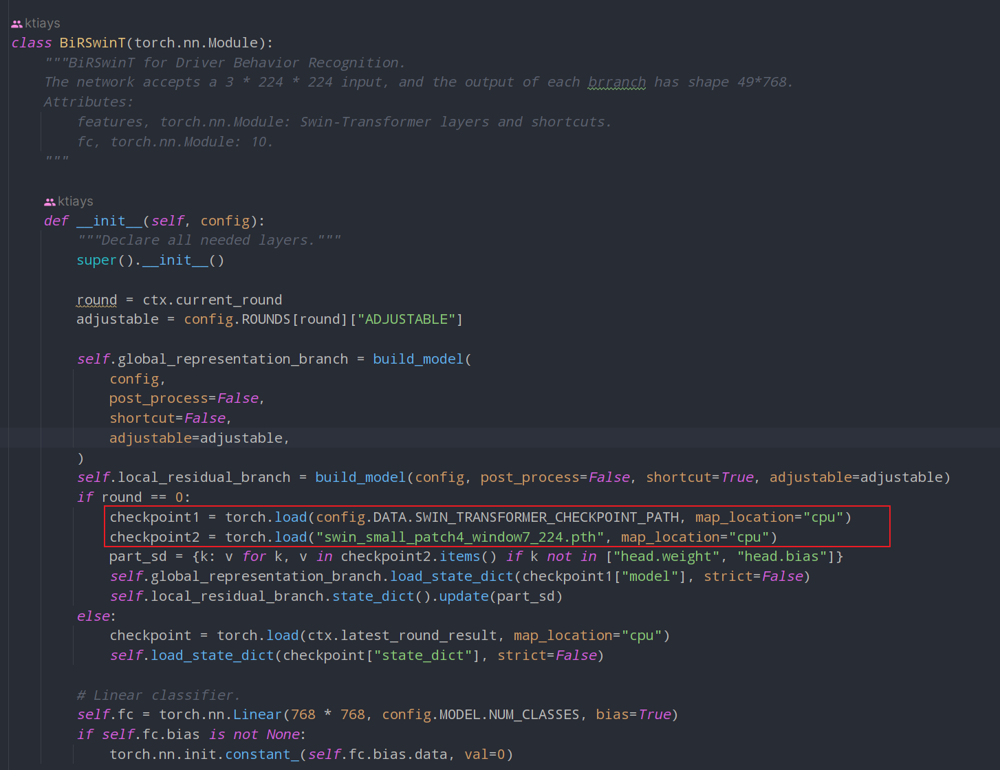
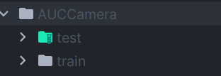
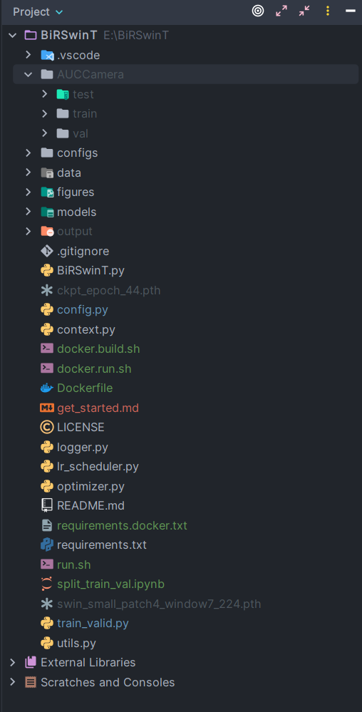
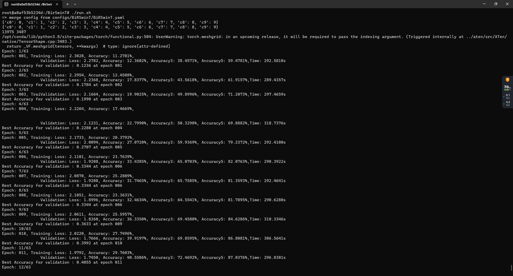

# How to Run the BiRSwinT Code

This tutorial assumes you're running Python version 3.9.

## Preparing the Pretrained Model File

Before we get started, we need to download two pretrained model files.

In [BiRSwinT.py](BiRSwinT.py), there are two checkpoints where we need to use these files.



1. **config.DATA.SWIN_TRANSFORMER_CHECKPOINT_PATH** - the default value of this config is `ckpt_epoch_44.pth`

2. `swin_small_patch4_window7_224.pth`

   You can download these two files from here: https://huggingface.co/Pluto2469/BiRSwinT/tree/main, and put these file in the root directory of this project.

## Preparing the Training and Validation Dataset

The paper indicates that the dataset used for training and validation is the State Farm Distracted Driver Detection and AUC Distracted Driver V1 and V2.

You can download the State Farm Distracted Driver Detection dataset from Kaggle: https://www.kaggle.com/c/state-farm-distracted-driver-detection/data.

For AUC Distracted Driver V1 and V2, you need to sign a License Agreement and email the author to request the dataset. The two license agreement and instructions can be found in the https://abouelnaga.io/distracted-driver/.

After we obtained the dataset, we need to prepare the training and validation dataset. Take State Farm Distracted Driver Detection dataset as an example.

1. Create a directory named `AUCCamera` in the root directory.

2. Download the dataset from Kaggle: https://www.kaggle.com/competitions/state-farm-distracted-driver-detection/data

3. Extract the data into the `AUCCamera` directory. The two CSV files are not needed and can be safely deleted.

4. Move the 'train' and 'test' folders out of the 'imgs' folder. Remove the 'imgs' folder if you like.

   Your `AUCCamera` directory should now look like this:

   

5. Since we don't have category labels for the test images, we can partition our training images into a training and a
   validation set. We have written a Jupyter notebook ([split_train_val.ipynb](split_train_val.ipynb)) for this purpose,
   which you can find in the root directory.

6. After completing the steps above, your project folder should look like this:

   

   Verify the total number of images in the training and validation sets to ensure that you've partitioned the data
   correctly.

## Running the Code

### Running in a Conda/Virtual Environment

If you prefer to run the code in your conda or virtual environment, rather than a Docker container or a virtual machine,
you can simply install the requirements using pip and then execute [run.sh](run.sh).

   ```shell
   pip install -r requirements.txt
   ```

### Recommended Method: Running in Docker

If you don't have PyTorch, CUDA, or other dependencies, or if you'd like to simplify the process, it's recommended to
run the code in Docker.

1. Run [docker.build.sh](docker.build.sh).

2. Edit [docker.run.sh](docker.run.sh) to mount your project folder. In our case, we've stored the project in my E drive,
   and we run
   scripts in Windows WSL2 Ubuntu, so we've mounted the project folder in the E drive(`/mnt/e/BirSwinT`) to the Docker
   container.

   ```shell
   docker run -it --gpus=all -v /mnt/e/BirSwinT:/BirSwinT birswint:base /bin/bash
    ```

   Replace `/mnt/e/BirSwinT` with the path of your own project folder.

3. Run [docker.run.sh](docker.run.sh).

   `docker.run.sh` will navigate you to the Docker container, where you can execute [run.sh](run.sh) or the following
   script (which
   is the same as `run.sh`) to train and validate the framework:

   ```shell
   python train_valid.py --cfg=configs/BiRSwinT/BiRSwinT.yaml
   ```

## Starting the Training and Validating Process

If you've started `run.sh` correctly, you should see a prompt like this:

